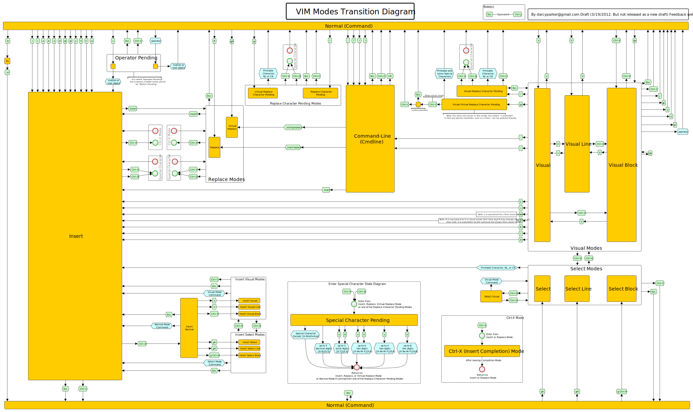

# RESOURCES

## Links
-[Markdown Cheatsheet](https://www.markdownguide.org/cheat-sheet/)

-[Explain Shell](https://explainshell.com/)

-[Wizard Zines](https://wizardzines.com/)

## Images/Diagrams
Vim
